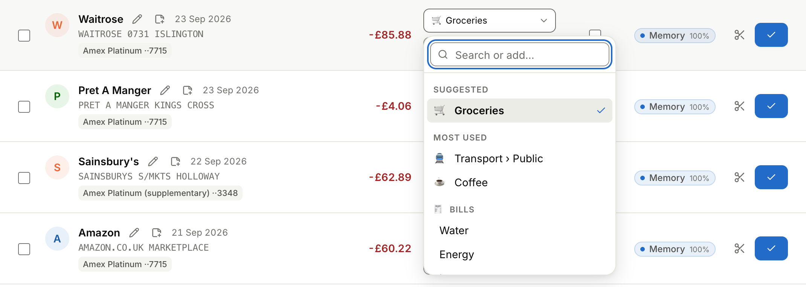
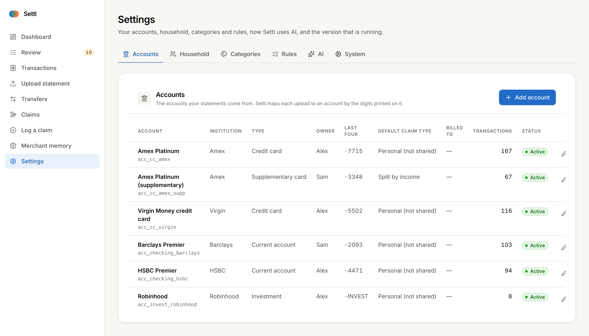
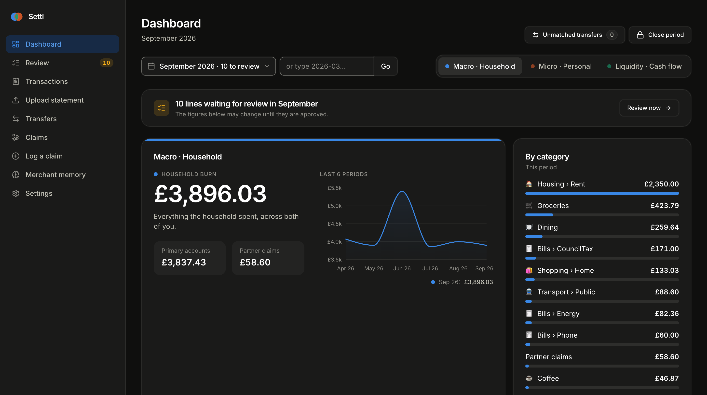

# Settl

**Shared money, settled. On your machine, not someone else's.**

Most money apps are free because you are the product: they want your bank login,
copy your transactions to their cloud and learn what you buy. Settl does the opposite.
It runs on a computer in your home, reads the statements you download from your bank,
and tells the two of you who owes whom. Nothing is sold, shared or tracked, nothing
leaves your home without your say-so, and the code is open for anyone to check.

It is for two people who share a home, the bills, the weekly shop and the odd
holiday, each with their own accounts and cards, and who are done with the spreadsheet.

<p align="center"></p>

## Your data stays yours

* **No bank logins, ever.** You download a statement (PDF, CSV or spreadsheet) and drop
  it in. Settl never asks for your banking password and cannot move money.
* **No cloud, no account, no tracking.** Settl and its database live on your machine:
  a Mac mini, a NAS, an old laptop. There is no sign-up, no analytics, no adverts and
  nobody to sell your data to.
* **Your statements stay put.** Uploaded files are read and then deleted; only the
  lines you need are kept, in your own database, backed up nightly on the same box.
* **AI on your terms.** Settl can ask an AI model to tidy merchant names and suggest
  categories. You choose the provider, or a model running on your own hardware, or no
  AI at all: with it switched off Settl works from your rules and the merchants it has
  learned. When it is on, what goes out is exactly this: the statement line being
  sorted (say "WAITROSE 1234 LONDON"), the month's totals per category for the monthly
  summary, and the text of a PDF only if the built-in readers can't make sense of it.
  Never your files, your logins or your ledger as a whole.
* **Open source.** MIT licensed. Read it, audit it, change it.

## Why you'll like it

* **Drop in a statement, get a sorted month.** Any bank or card, any layout we have
  met so far, including a main card and a supplementary card on one statement. Every
  line gets a merchant, a category and a "shared or not"; you only review the few
  Settl isn't sure about.
* **It learns your merchants.** Approve Waitrose once and every Waitrose after that is
  filed for you. Pick categories by typing ("gro" finds Groceries), with the ones you
  use most at the top.
* **Split the tricky ones.** £10 at Marks & Spencer becomes £6 groceries shared by
  income and £4 for a personal item, in one dialog.
* **One running balance.** Shared costs, each person's own items and the payments
  between you add up to one figure: who owes whom, carried from month to month. Pay
  part of it now and the rest rolls over; agree a fresh start whenever you like.
* **Built for two.** Your partner gets their own login on their phone to log what they
  paid and see the balance, and nothing else.
* **Looks after itself.** Everything is set up in the app, it updates itself from
  GitHub with one click, backs up every night and before every update, and tidies up
  after itself.

## See it


*The month at a glance: what the household spent, how it compares with recent months
and where it went. Two more views show your own true share and your cash flow.*


*The Review page: Settl has already filed each line from the merchants it knows; you
glance, fix the odd one and approve the rest in one go. Filter by card, rename a
merchant or add a note when the bank's description says nothing useful.*


*Type to find a category, or take the suggestion: what this merchant was filed under
before, then the ones you use most.*


*£10 at M&S: £6 of groceries shared by income, £4 of flowers that were only yours.*


*The same receipt in the list with its parts underneath, and notes on the lines worth
remembering.*


*Your partner's phone: the window cleaner they paid in cash, logged in a few taps and
shared the way they choose.*


*Settings: the two of you, your accounts and cards, categories, rules and AI live here,
not in a config file. The System tab shows the last backup and updates Settl with one
click.*


*And after dark.*


*One password each: yours opens everything, your partner's opens the claim form and
the balance.*

## Run it in five minutes

You need a machine with Docker that stays on; a Mac mini or a NAS is ideal.

```bash
git clone https://github.com/mattiaborsoi/personal-finance settl && cd settl
cp .env.example .env     # then open .env and set the passwords and keys
docker compose up -d --build
```

The app refuses to start with the placeholder passwords, so do edit `.env` before
the last command. Open http://localhost, sign in with `PRIMARY_PASSWORD`, and set up
the two of you, your accounts and your categories under Settings; your partner opens
http://localhost/claim with `SECONDARY_PASSWORD`. Prefer a file? Copy
`config.example.yaml` to `config.yaml` before the first start and it seeds those
defaults; whatever you change in Settings afterwards wins.

It works with no AI key at all: set `LLM_PROVIDER=none` and `EMBEDDING_PROVIDER=hash`
in `.env` and Settl runs on your rules and the merchants it has already learned.

Everything else (updating, backups, running without an LLM, what goes where) is in
[docs/TECHNICAL.md](docs/TECHNICAL.md).

## Under the bonnet

Five containers on one box: the web front, the app, a database that doubles as the
merchant memory, a small proxy to whichever AI provider you choose (or none, if you
already run one), and an updater that pulls new versions. How they fit together, the
settlement maths and the security model are in [docs/TECHNICAL.md](docs/TECHNICAL.md).

**Private by design.** Settl runs on your machine and your statement files never leave
it. The only things that ever go out: short merchant lines for the AI to categorise
(if you use a hosted model), the page text of a PDF only when the built-in parsers
cannot read it, and one request to GitHub to check for updates. Each of those can be
switched off in Settings or `.env`.

* [docs/TECHNICAL.md](docs/TECHNICAL.md): architecture, deployment, the maths,
  configuration, schema and development setup.
* [docs/API.md](docs/API.md): the REST contract.
* [docs/BLUEPRINT.md](docs/BLUEPRINT.md): the original specification.

## Contributing

Bug reports and ideas go in [issues](https://github.com/mattiaborsoi/Personal-Finance/issues);
changes come as pull requests against `main`, see [CONTRIBUTING.md](CONTRIBUTING.md).
Security problems: [SECURITY.md](SECURITY.md). Settl is released under the
[MIT licence](LICENSE).
