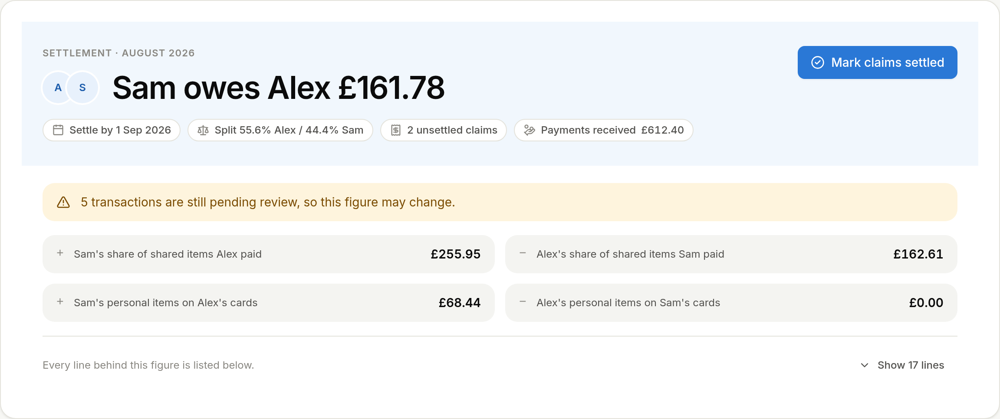
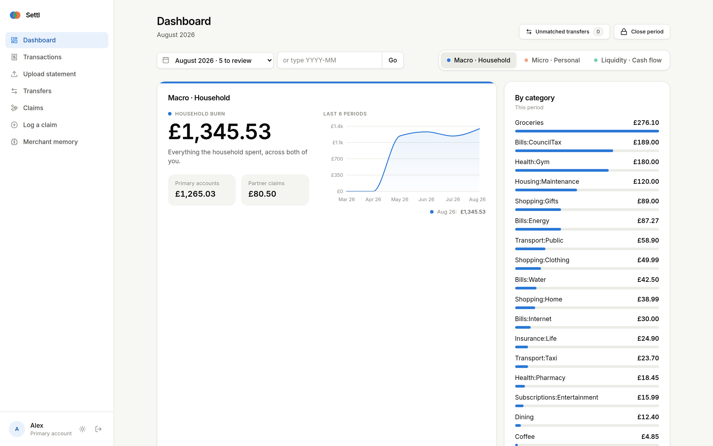
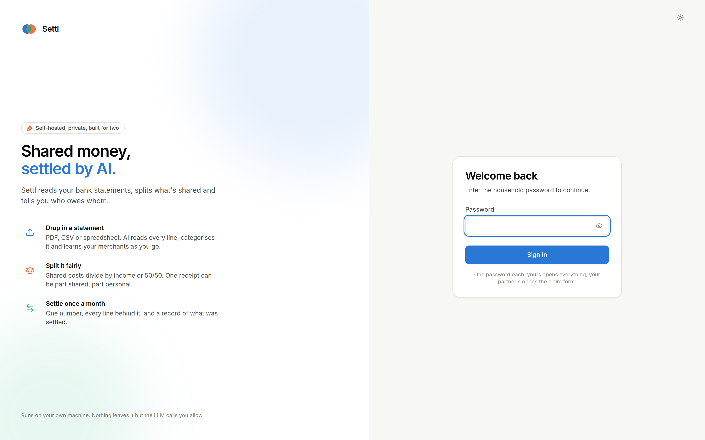
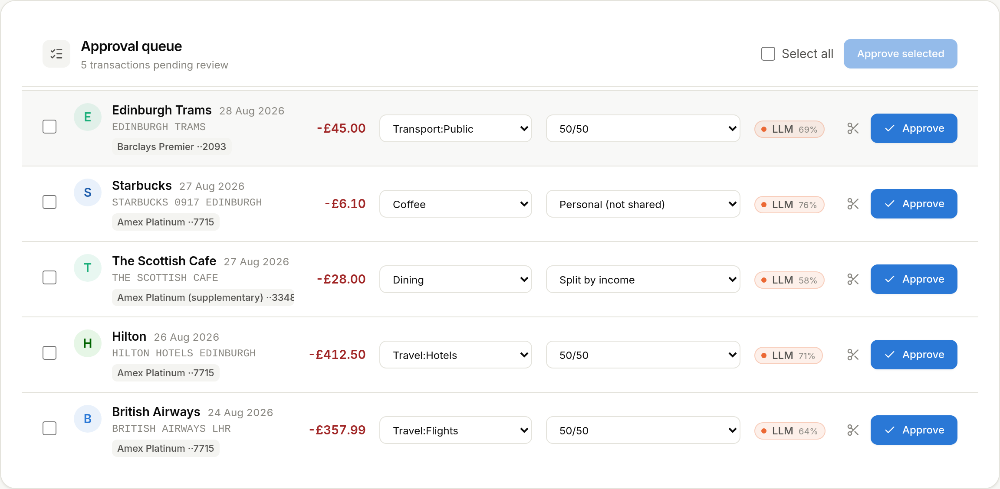
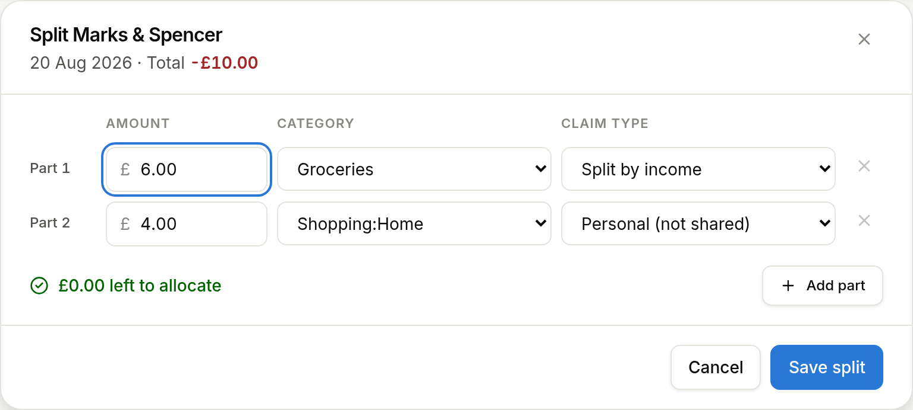
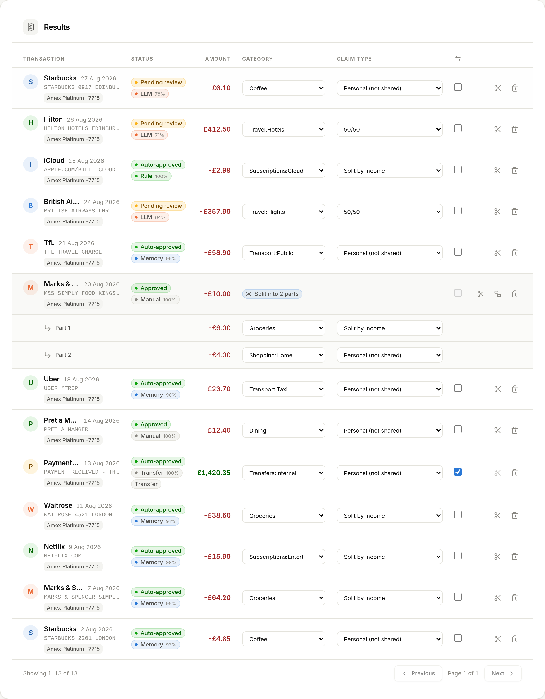
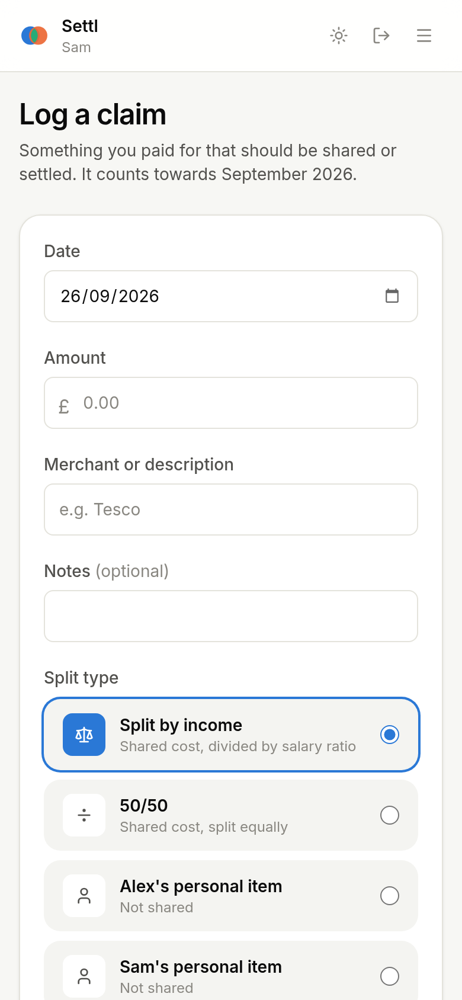

# Settl

**Shared money, settled by AI.**

Settl reads your bank statements, works out what's shared and tells the two of you
who owes whom: one figure, once a month, on a machine you own.

It is for two people who share a flat, the bills, the weekly shop and the odd holiday,
each with their own accounts and cards, who would rather not keep a spreadsheet.

<p align="center"></p>

## Why you'll like it

* **Drop in a statement, get a sorted month.** A PDF, CSV or spreadsheet from any bank
  or card. Every line gets a merchant, a category and a "shared or not"; you only
  approve the few Settl isn't sure about.
* **It learns your merchants.** Approve Waitrose once and every Waitrose after that is
  filed for you. The more you use it, the less it asks.
* **Split the tricky ones.** £10 at Marks & Spencer becomes £6 groceries shared by
  income and £4 for a personal item, in one dialog.
* **One figure, settled.** Your partner logs the cash they paid from their phone, card
  payments and transfers cancel themselves out, and at month end Settl shows who owes
  whom, by when, with every line behind it.

## See it


*The month at a glance: what the household spent, how it compares with recent months,
and where it went. Two more views show your own true share and your cash flow.*


*One password each: yours opens everything, your partner's opens the claim form and
the month's figure.*


*The queue: the Starbucks, the TfL fares and the Netflix are already filed; you glance,
fix the odd one and approve the rest in one go.*


*£10 at Marks & Spencer: £6 groceries shared by income, £4 personal.*


*The same receipt in the list with its parts underneath, alongside the month's Hilton
stay and British Airways flight on the Amex Platinum.*


*Your partner's phone: the Uber they paid for, logged in three taps and shared the way
they choose.*

## Run it in five minutes

You need a machine with Docker that stays on; a Mac mini or a NAS is ideal.

```bash
git clone https://github.com/mattiaborsoi/personal-finance settl && cd settl
cp config.example.yaml config.yaml   # the two of you, your accounts, your rules
cp .env.example .env                 # passwords and keys (the app refuses placeholders)
docker compose up -d --build
```

Open http://localhost, sign in with `PRIMARY_PASSWORD`; your partner opens
http://localhost/claim with `SECONDARY_PASSWORD`.

It works with no AI key at all: set `LLM_PROVIDER=none` and `EMBEDDING_PROVIDER=hash`
in `.env` and Settl runs on your rules and the merchants it has already learned.

Everything else — updating, backups, running without an LLM, what goes where — is in
[docs/TECHNICAL.md](docs/TECHNICAL.md).

## Under the bonnet

Four containers on one box: the web front, the app, a database that doubles as the
merchant memory, and a small proxy to whichever AI provider you choose. How they fit
together, the settlement maths and the security model are in
[docs/TECHNICAL.md](docs/TECHNICAL.md).

**Private by design.** Settl runs on your machine and your statements never leave it;
the only thing that goes out is a handful of small, anonymised questions to the AI, and
even those can be switched off.

* [docs/TECHNICAL.md](docs/TECHNICAL.md): architecture, deployment, the maths,
  configuration, schema and development setup.
* [docs/API.md](docs/API.md): the REST contract.
* [docs/BLUEPRINT.md](docs/BLUEPRINT.md): the original specification.
